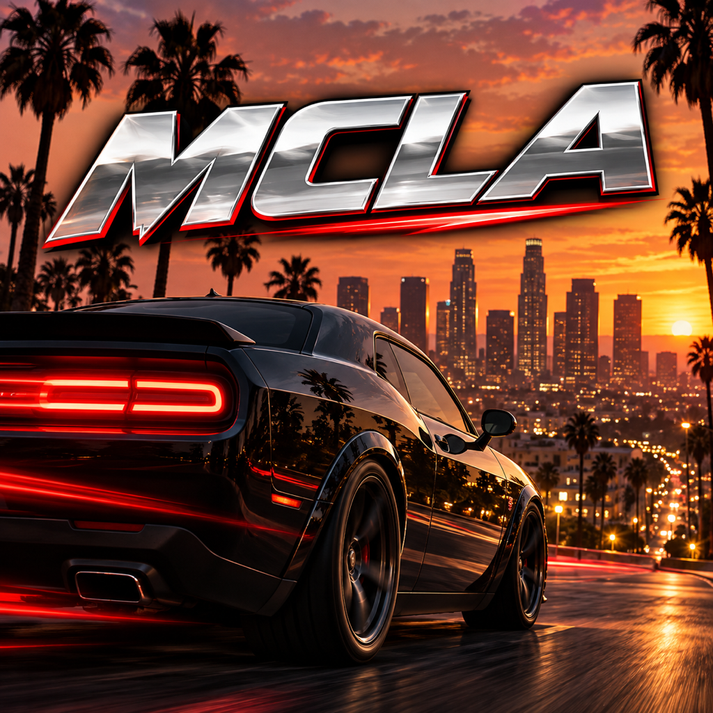
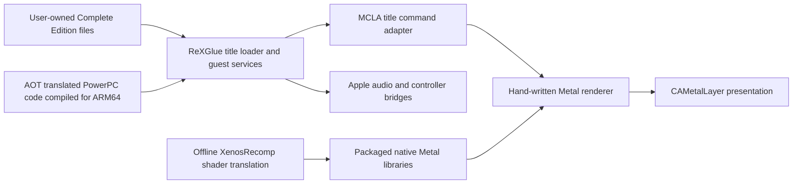

<p align="center"></p>
<h1 align="center">MCLA 4iOS</h1>
<p align="center"><strong>0.1.0 · Initial public beta</strong><br>Midnight Club: Los Angeles — Complete Edition on iPhone and iPad</p>
<p align="center"><a href="https://github.com/KoreanSeats1/MCLA-4iOS/releases/tag/v0.1.0">Download the sideloading IPA</a> · <a href="https://youtu.be/zmHd-WfsaX4">Watch gameplay</a> · <a href="docs/KNOWN_BUGS.md">Known bugs</a> · <a href="CREDITS.md">Credits</a></p>

MCLA 4iOS is an experimental ARM64 iOS/iPadOS adaptation of the **LARecomp** static recompilation project. The port combines ahead-of-time PowerPC translation, the ReXGlue compatibility runtime, a native Apple application shell, and a hand-written, title-specific Metal renderer. **You must provide your own extracted Xbox 360 Complete Edition game files. The IPA and repository contain no game archives, original executable, music, movies, saves, or disc image.**

This is a first beta, not a claim of complete compatibility. Real driving and races have been tested on iPhone Air and an M5 iPad Pro. There are still visible rendering bugs. Please read [Known Bugs](docs/KNOWN_BUGS.md) before downloading. This is an independent community project, not an official Rockstar product or an endorsement by any upstream project.

## Gameplay showcase

[](https://youtu.be/zmHd-WfsaX4)

**[Watch the supplied gameplay video on YouTube](https://youtu.be/zmHd-WfsaX4).** This is a demonstration, not a universal performance guarantee. The supplied gameplay screenshot showed approximately **58.1 FPS, 17.2 ms frame interval and 13.7 ms GPU time** with experimental 60 FPS enabled. Those values are a momentary sample; they do not establish an average for a whole race or sustained performance after thermal throttling.

## Quick start

1. Download **MCLA-4iOS-0.1.0.ipa** from the [0.1.0 release](https://github.com/KoreanSeats1/MCLA-4iOS/releases/tag/v0.1.0).
2. Sign and install it with your own Apple account using Sideloadly or AltStore Classic. This is a re-signable IPA, not an App Store or TestFlight installation.
3. Open MCLA once; it automatically creates `MCLA_Game_Files`. Dismiss the setup message, then close the app.
4. Copy your legally obtained, extracted **Xbox 360 Complete Edition** files into `MCLA_Game_Files` in the app's Documents folder.
5. Reopen MCLA, confirm game data is detected, configure your controller or touch controls, and launch.
6. Start with the standard **30 FPS** mode. **Graphics → Experimental → Native 60 FPS** is optional and must be selected before launching a session.

No jailbreak or JIT entitlement is required by this implementation. An Apple-compatible signing/install method is still necessary.

## Requirements and compatibility

| Item | Requirement / current evidence |
|---|---|
| OS | The app's deployment minimum is iOS/iPadOS **18.0**. This is a build minimum, not proof that every device running 18.0 is compatible. |
| CPU/GPU | Physical ARM64 iPhone or iPad with Metal. Initial gameplay testing covers **iPhone Air** and **M5 iPad Pro**. Older devices are unverified. |
| Game | Your own extracted **Midnight Club: Los Angeles — Complete Edition for Xbox 360**. PS3 files and an unopened ISO are not drop-in inputs. |
| Storage | Space for the installed application **and your complete extracted game folder**, with room for saves and temporary copy operations. |
| Input | A compatible extended-gamepad controller is recommended. Touch controls, adjustable layouts and tilt steering are included. |
| Signing | A sideloading tool and your own Apple account/signing identity. The release contains no reusable developer certificate or private key. |
| Simulator | Useful for launcher/menu development; it is not a validated way to play this game. |

The initial supported executable baseline is recorded in [GameDataManifest.json](MCLAApp/Resources/GameDataManifest.json): SHA-256 `c386f4001fa569e6ad4b982f441f67412f00b3f47c166134555cd4b59854a432`. The launcher detecting filenames is not a promise that another regional revision or patched executable is interchangeable with the AOT build.

## Detailed installation

### Option A: Sideloadly on macOS or Windows

Use the official [Sideloadly website](https://sideloadly.io/) and [FAQ](https://sideloadly.io/faq.html). Avoid repackaged downloads that request unrelated configuration profiles.

1. Download Sideloadly from its official website and install its current macOS/Windows prerequisites. On Windows, follow Sideloadly's own Apple driver/iTunes/iCloud requirements; the Apple Devices file-transfer instructions below are a separate step.
2. Download **MCLA-4iOS-0.1.0.ipa** from the release's **Assets** list. Keep it as an IPA. The source ZIP, checksum file and JSON manifest are not the app installer.
3. Connect your iPhone/iPad by USB, unlock it and accept **Trust This Computer** if prompted. Confirm the device appears in Sideloadly.
4. Select that device in Sideloadly. Drag the IPA onto its IPA area, or use the IPA selector to choose it.
5. Use the normal Apple-ID signing workflow, enter your Apple account and start installation. Complete any authentication prompts in the tool. Keep the same account and bundle identifier for future updates.
6. Wait until Sideloadly reports completion and the MCLA icon appears on the device. Installation places the app on the device; **it does not install the game files**.
7. If iOS asks you to trust the developer, open **Settings → General → VPN & Device Management**, select the development-app entry associated with your signing account and complete the trust prompt. This entry depends on the signing method; it may not appear for every installer.
8. If Developer Mode is required, open **Settings → Privacy & Security → Developer Mode**, enable it, restart when requested and confirm after restart. Follow Apple's [Developer Mode instructions](https://developer.apple.com/documentation/xcode/enabling-developer-mode-on-a-device). If the setting is absent, finish the development-app installation first.
9. Open **MCLA** once. The app automatically creates its game folder and may display **Filesystem created**. Dismiss the message. **WAITING FOR GAME DATA** is expected at this stage.
10. Close MCLA before transferring the game files. Continue with the folder instructions below.

A free account generally has short-lived signing and app-count limits; a paid account has different limits. Follow the signing tool's current documentation rather than assuming the app never needs refreshing. The release intentionally has no personal provisioning profile: your sideloading tool must sign it for your device.

### Option B: AltStore Classic

Follow the official [AltStore Classic installation guide](https://faq.altstore.io/altstore-classic/how-to-install-altstore-macos) for your platform. **AltStore Classic** is the relevant product for importing an arbitrary IPA; do not assume AltStore PAL is an equivalent installation route.

After AltStore Classic and AltServer are configured, download the IPA to Files, import it from AltStore's My Apps screen, and let AltStore sign/install it. Keep AltServer available as required for refreshing. Free-account restrictions include a small active-app limit; see [AltStore's app activation documentation](https://faq.altstore.io/altstore-classic/activating-apps). The game-data copy is a separate step after installation.

These are documented signing routes, not evidence that every signing-tool version has been tested against this beta. Report installation failures with the tool/version and the actual error.

### Prepare the game files on your computer

You need your own **extracted Xbox 360 Complete Edition** copy. The app does not download the game or extract an ISO. A `.iso`, `.zip`, `.7z` or PS3 folder cannot be launched directly. A ZIP can be used for transport only; it must be unpacked before play.

1. Open your extracted game folder on the computer.
2. Find the directory that directly contains **`default.xex`** and the **`xarchive_*.rpf`** files. If they are inside another directory, open that directory first.
3. Preserve **all** files and subfolders from that directory, with their original names and relative paths. The five files below are readiness checks, not the complete game.
4. For a whole-folder transfer, name the containing folder exactly **`MCLA_Game_Files`**. For a contents transfer, copy everything inside it into the app's existing folder of that name.

### Exact destination on the iPhone/iPad

**Files → Browse → On My iPhone / On My iPad → MCLA → MCLA_Game_Files**

The internal path is **the MCLA app's `Documents/MCLA_Game_Files/`**. Files displays the app's Documents directory as **MCLA**; you do **not** create another folder called `Documents` inside it. On some file-sharing lists the app may be shown as MCLAApp.

```text
Files → On My iPhone / On My iPad
└── MCLA                         ← the app's Documents location
    └── MCLA_Game_Files
        ├── default.xex          ← directly inside this folder
        ├── xarchive_audio.rpf
        ├── xarchive_audlo.rpf
        ├── xarchive_cache.rpf
        ├── xarchive_music.rpf
        └── …ALL remaining extracted files and subfolders…
```

Wrong layouts include:

```text
MCLA/default.xex                             ← outside the game folder
MCLA/Documents/MCLA_Game_Files/default.xex    ← extra Documents directory
MCLA/MCLA_Game_Files/MCLA_Game_Files/default.xex ← duplicated game folder
MCLA/MCLA_Game_Files/My Game/default.xex      ← extra extraction directory
MCLA/MCLA_Game_Files/game.iso                ← not extracted
```

### Transfer from a Mac with Finder

1. Open MCLA once on the device so its folder exists, then close it.
2. Connect by USB, unlock the device, and trust the computer if prompted.
3. Open Finder, select the device under **Locations**, then choose **Files**.
4. Find MCLA and expand its entry to see shared documents. This view represents the app's Documents location.
5. Drag the complete computer folder named **MCLA_Game_Files** onto the MCLA app entry. If a same-name folder prompts for replacement, proceed only for a new installation with an empty destination; back up existing content first.
6. Keep the device connected until copying finishes. Open Files on the device and verify the destination layout above.

If Finder will not transfer a folder or cannot merge into the existing folder, use the ZIP transport method below instead. Finder file sharing is documented by [Apple](https://support.apple.com/en-us/119585).

### Transfer from Windows with Apple Devices

Apple Devices' **Add File** action copies files into an app's shared documents. To preserve a large game folder and its subfolders, use a ZIP as a transport container:

1. On the PC, make **MCLA-transfer.zip** from your complete extracted game directory. This is a transport copy; retain your original extraction.
2. Connect/unlock the device, open **Apple Devices**, select the device, then **Files → MCLA**.
3. Click **Add File**, select `MCLA-transfer.zip` and complete the copy. Wait for the transfer to finish.
4. On the device, open **Files → Browse → On My iPhone/iPad → MCLA**. The ZIP should be here, beside `MCLA_Game_Files`.
5. Tap the ZIP to unpack it. Follow the ZIP placement steps below; the extracted folder's name can depend on how you created the archive.

Allow space for both the ZIP and unpacked game. This route uses [Apple's documented file-sharing interface](https://support.apple.com/en-us/120402); it is not an in-app game importer.

### Place unpacked files using the device's Files app

These steps also work when your extracted folder arrived through iCloud Drive, an external drive or another Files location.

1. If using a ZIP, tap it in Files to extract it. Open the resulting folder, then any enclosing folders, until **you can see `default.xex` directly**.
2. In that directory, use **… → Select**, select **every file and subfolder**, then choose **Move**. Do not select only the XEX or the five readiness-check archives.
3. Browse to **On My iPhone/iPad → MCLA → MCLA_Game_Files** and move the selected contents into that directory. If using Copy instead, open this directory and paste the contents there. Do not paste the enclosing game folder inside it.
4. Open `MCLA_Game_Files` and confirm `default.xex` and the archive files are immediately visible, with the remaining extracted content beside them.
5. Once verified, the transport ZIP and empty staging folder can be removed to recover space. Keep your computer's original extraction/backup.

If **MCLA** is not visible, launch the installed app once, close it, and return to **Files → Browse → On My iPhone/iPad**. Downloads and iCloud Drive are staging locations; files left there are not in the game's active directory.

### Verify the copy and launch

1. Wait for all transfer/extraction activity to finish. Do not launch while archives are still copying.
2. Reopen MCLA. With the core files detected and the renderer available, the launcher displays **READY TO DRIVE**.
3. Configure controls and graphics, then use the launch button. Start with standard 30 FPS; enable experimental 60 FPS before launch if desired.
4. If it still says **WAITING FOR GAME DATA**, inspect the exact folder layout. Common causes are an extra parent folder, a duplicate `MCLA_Game_Files`, a compressed/unextracted game, or files copied into Downloads rather than MCLA.
5. If detection succeeds but later content is missing or launch fails, confirm the **entire** extraction copied successfully and that its Xbox 360 Complete Edition revision matches the supported baseline. Filename detection does not validate every archive's integrity.

The game folder belongs in the app's Documents storage, not inside the IPA, app bundle, saves folder or diagnostic folder. Reinstalling after deleting MCLA can remove that storage; export saves and keep a separate game-file backup before doing so.

### Controls, saves and updates

Pair your controller through iOS, then configure the launcher's Controls panel before starting. The host uses Apple's GameController framework and maps controls into the title's guest input contract. Touch controls can be repositioned/resized, and tilt steering has enable/invert preferences. Your saved layouts are independent of the renderer defaults.

The launcher has save-management actions, including export/import. **Export a backup before changing signing identity, deleting the app, or installing a substantially different build.** Imported backups can replace current saves only after the UI's confirmation. Changing an app's bundle identifier normally creates a different container; deleting the app can remove its game folder and saves. An update installed over the same signed app is preferable to uninstalling first. Do not upload your entire game folder with bug reports.

## Graphics settings and defaults

| Setting | Behavior |
|---|---|
| Scene resolution | 720p, 900p or 1080p height; device aspect is handled separately. Higher settings increase scene-pixel cost. |
| FSR upscaling | Optional AMD **FSR 1** spatial EASU/RCAS path for presenting the rendered scene at output size. It is not temporal reconstruction or frame generation. |
| Texture filtering | Original/bilinear/anisotropic choices, with 4× filtering as the fresh baseline. |
| Glow & bloom | Balanced/original/reduced glow choices. Changes are applied on the next launch. |
| Disable Motion Blur | Turns off the audited guest motion-blur paths; it does not guarantee every blur-looking effect is motion blur. |
| Disable Depth of Field | Controls the guest circle-of-confusion/composite inputs. **Depth of field is enabled by default.** |
| Retail Mode | Gates ordinary diagnostic logging, captures and profiling. Enable it for a normal play session. |
| FPS & Frame-Time Graph | Available with diagnostics enabled. Double-tapping the graph starts a bounded timing capture. |
| Experimental → Native 60 FPS | The **only experimental menu option**. Standard mode remains 30 FPS. |

Fresh defaults are 720p on iPhone and 1080p on iPad, FSR off, 4× filtering, balanced bloom, motion blur on, depth of field on, and 60 FPS off. Fresh Retail Mode defaults differ by device: on for iPhone, off for iPad during this beta's diagnostic development. Set Retail Mode on explicitly if you want logging/profiling off on either device.

Existing saved preferences are retained. The Defaults action restores the saved graphics baseline and turns experimental 60 FPS off; it does not reset your control layout. Most scene/timing choices are locked during a running game and require closing/relaunching. FSR has an independent live presentation switch.

The old Packed Color Correction, Full-Screen Fades and Stable Road Detail switches have been removed. Their renderer behavior runs automatically. Making these automatic is a UI decision, **not a claim that the remaining blue-glow or road-flicker reports are resolved**.

## The experimental native 60 FPS patch

The 60 FPS option builds on **BadassBaboon's high-frame-rate research and LARecomp's engine hooks**. It is not a one-byte speed hack and is not MetalFX frame generation. The implementation renders real frames with an updated timing path.

The retail title contains **two paths that can replace a measured delta with the fixed console timestep**. Correctly adapting only one leaves the other able to publish the old fixed interval. This port enables both corrections together:

- `MCLAUseRealDelta` bypasses fixed-delta substitution after the relevant timer accumulators are updated.
- `MCLAFixedStepPath` reads the timer's already measured, unscaled delta at `timer + 0x58`, before the game's original timescale multiplication and stores.
- The guest swap-interval request changes from interval two to interval one. Both native host pacers also change to a 60 Hz period from the same launch preference.
- The timer's existing guards/clamps, timescale and **physics substep count** are retained. No late rewrite of the substep count is used.
- The existing 125 ms hitch guard remains active, bounding a long load/resume stall rather than allowing a multi-second simulation step.

The chase camera and chassis ground-depth filter also need frame-rate-independent behavior. For a console-reference smoothing coefficient `k30`, the replacement is:

```text
k(dt) = 1 − (1 − k30)^(30 × dt)
chassis depth alpha(dt) = 1 − 0.90^(30 × dt)
```

The camera hook accounts for the engine already halving its raw coefficient when its rounded FPS is below 60. Halving it again creates a discontinuity as performance crosses that boundary. Position and look-at corrections use the same reference curve and finite-input guards.

Tests compare one-second camera/chassis decay at 30, 45, 59, 60, 61 and 120 FPS, including the rounding boundary, and exercise presentation phase, rate changes and late-frame rebasing. These tests validate the math and pacer behavior. They **do not prove every car, collision, race script, traffic behavior or cinematic is correct at 60 FPS**. On-device regression testing is still required, particularly after the device warms up.

A 60 FPS frame has **16.67 ms** available. The earlier optimization target of 20 ms is useful headroom for 30 FPS, but is insufficient for a locked native 60 FPS rate. Start with 30 FPS on demanding devices and test 60 FPS before relying on it for a long session.

## Technical architecture



### Static recompilation and the Apple host

PowerPC instructions are translated to C++ ahead of time, then compiled into native ARM64 machine code. The compatibility runtime still has substantial work to do: guest memory, byte order, kernel exports, threading, filesystem semantics, title startup and audio/input contracts. "AOT" does not mean the game became an original-source engine port or that Xbox services disappeared.

The UIKit shell owns lifecycle, the visible CAMetalLayer, launch/settings UI, saves and the user's files. A versioned C bridge separates host ownership from the runtime. Backgrounding gates guest work with a condition variable without blocking UIKit's main thread. A custom vblank worker handles backward clock movement and bounds catch-up work, avoiding an unbounded unsigned-underflow catch-up loop.

### Why a direct Metal renderer

Early bring-up used shared Xenos/Vulkan machinery as a reference. The production path now intercepts the audited title command/state contract and executes native Metal work directly. It does not instantiate a generic Xbox GPU command processor, and build verification checks that Vulkan/MoltenVK/generic-processor symbols are absent from the released executable.

This is a title-specific implementation, not a general solution for every Xbox 360 game. It owns render-pipeline creation, vertex declarations and endian conversion, source-texture decode/untile, depth/color attachments, resolves, viewport/scissor mapping, sampling, resource lifetime and presentation. Three completion-owned upload slots prevent CPU reuse while the GPU still owns in-flight memory.

### Offline shader translation and coverage

The beta packages **603 native Metal title libraries**. XenosRecomp lineage provides the translation machinery; this port supplies capture/container reconstruction, audited shader ABI mapping, offline compilation and title-specific validation. A library count is a coverage inventory, not a proof that every possible race/weather/menu combination has been captured.

The ALU-order correction preserves instruction-local source values when vector and scalar units read a shared destination register before either result is written. Emitting sequential host writes can otherwise make scalar arithmetic read the just-written vector result. Snapshot scopes remain inside instruction predication. Shader constants, semantics, masks and register indices must retain their original contract.

Most normal play performs no runtime shader source translation. New missing shader pairs can be captured only with diagnostics enabled, under a fixed budget, for a later offline build. **Two newly observed programs are still absent in 0.1.0**; see Known Bugs.

### Texture, color and presentation correctness

Packed vertex colors are interpreted using the shader's destination swizzle rather than adding an unconditional second red/blue swap. A host Metal test covers red, yellow, green and blue through normalized and integer fetches. Source format `1_5_5_5` is explicitly expanded to RGBA8 after guest endian conversion; produced host resolve textures follow a separate path to avoid applying guest storage swizzles twice.

Device-aspect gameplay rendering and authored 16:9 HUD placement are handled separately. The full-screen overlay classifier recognizes full clip-space rectangles, including three-corner rectangle-list geometry, while keeping ordinary HUD elements in their authored frame. This is deliberately narrower than stretching every UI draw. The reported look-behind/title fades still require regression testing on actual gameplay paths.

Source material textures retain the original guest LOD bias rather than the earlier hidden −1.25 sharpening correction. That reduces one source of over-sharp mip selection, but does not prove intermittent road flicker is entirely mip-related; geometry/depth behavior remains a possible contributor.

### CPU and GPU work removed or reused

- **Compact draw state:** the native adapter's canonical draw representation was reduced from approximately **14,208 bytes to 1,360 bytes**, avoiding copying unused state through every draw.
- **Exact state reuse:** shader-definition snapshots, prepared pipelines, vertex/index interpretations and binding groups are reused only while their relevant inputs remain equal. Unfamiliar wrappers prove payload equality; writable/inline data cannot be treated as permanently immutable.
- **Constant-bank reuse:** used constant banks and shared push data are compared/reused rather than uploading the same data for every draw. Exact snapshots prevent a hash shortcut from silently accepting changed values.
- **Encoder-state suppression:** unchanged viewport, cull, winding, depth bias, textures, samplers and other encoder state avoid repeated Metal API calls.
- **Geometry preparation:** reusable endian/fixup plans and scratch storage reduce allocation churn; dynamic geometry uses completion-owned shared upload rings.
- **Resource invalidation:** buffer unlock/release and texture refresh participate in cache invalidation. Source and produced textures keep distinct identity/ownership rules.
- **Presentation:** steady-clock deadline accumulation handles host pacing, while a fixed-phase Metal timestamp planner provides predictable compositor lead and rebases when late. Desktop frame limiting is not added on top.
- **Diagnostics gating:** Retail Mode bypasses ordinary logging, captures, per-draw profiling and the frame graph rather than merely hiding an overlay.

These are implemented mechanisms, not independently measured percentage wins. CPU preparation, GPU execution, queue delay and presentation interval are different quantities; adding overlapping measurements produces misleading totals.

### Audio, diagnostics and evidence

Audio uses the runtime's guest XMA contract and an Apple output bridge. The title can wait on real decoder progress; a silent fake mixer is not a correct substitute. Input uses GameController, touch and CoreMotion paths at the host boundary.

Diagnostic captures include frame interval, GPU time, draw preparation, waits, cache activity and OS thermal pressure. Some displayed values are the latest completed sample rather than an exact match for the current row. Thermal state is an OS pressure category, not a temperature sensor. Sparse pass timings can overlap; do not sum them as if they were serial frame time.

Release validation covers the signed device build, packaged library inventory, absence of the legacy runtime graphics backend, existing timing/color/overlay tests and menu inspection. Public diagnostic documents are curated summaries; private device logs and identifiers are excluded.

## Known bugs and limitations

The full maintained list is [docs/KNOWN_BUGS.md](docs/KNOWN_BUGS.md). The most important initial-beta issues are:

- **Blue distant traffic/light glows:** nearby red taillights can coexist with blue distant glows. Root cause is unresolved. A bounded color-source trace is included for a diagnostic play session; there is no claim of a completed lighting fix.
- **Two missing shaders:** VS `D866F0D1394908B8` and PS `F1DAD9A46DA1A834` were observed in the latest 60 FPS M5 run. Four adapter rejected draws were recorded in that session. These programs are not included in the 603-library package.
- **Road texture flicker/shimmer:** automatic LOD behavior addresses one candidate cause; a complete regression pass is outstanding.
- **Checkpoint smoke/colors:** shader coverage and packed-color changes were added after reports of missing smoke and wrong red/yellow colors. Correct appearance across all checkpoints is not yet confirmed.
- **Full-screen fades:** fixes are automatic, but look-behind and title-screen transitions still need coverage confirmation on both device aspects.
- **New-game rear wheel/ride-height issue:** a physically lowered car with a rear tire in the ground was reported on Air. The hitch guard is preventative; it is not a verified root-cause fix for this issue.
- **60 FPS, video timing and thermal stability:** experimental timing corrections need longer driving, race, intro, pause/resume and warm-device tests. Broader device compatibility is unverified.

## Remaining optimization and engineering work

Correctness comes first: collect the actual color inputs for the blue-glow draw, recover the two missing programs, and reproduce the new-game suspension issue. More performance work should then be based on paired measurements rather than lowering unrelated quality settings blindly.

Priorities include long-session warm-device pacing, separating useful CPU execution from wall-clock waits, measuring render-pass bandwidth/resolve cost, bounding resource-cache maintenance, checking upload-ring pressure, and expanding deterministic regression scenes for particles, alpha, shadows, fades and streaming transitions. Native 60 FPS needs both CPU and GPU to fit the display budget.

**MetalFX frame interpolation is not implemented.** It remains a future investigation involving reliable depth/motion inputs, HUD composition, history reset and presentation scheduling. **SMAA and single-tile experiments are separate developer lab paths**, not active release settings. Their presence in source is not a promise that these features ship in the beta.

## Source and developer workflow

The repository publishes the Apple host, title adapter, direct renderer, diagnostic/test utilities, local compiler modifications, pinned upstream references and dependency patches. Original game code inputs, generated title AOT output, raw shader captures, game-derived build caches, signing identities and private logs stay local.

```sh
git clone --recurse-submodules https://github.com/KoreanSeats1/MCLA-4iOS.git
cd MCLA-4iOS
sh tools/apply_dependency_patches.sh
```

The dependency lock records exact LARecomp, Theft4-foundation and XeniOS-reference revisions. LARecomp and foundation changes are published as patches rather than silently changing someone else's upstream checkout. XeniOS is a reference for audited GPU semantics; it is not the runtime backend in this release.

For a **device build**, prepare title AOT output from your own executable using the pinned ReXGlue host tools and LARecomp manifest/hooks; recreate the offline title shader corpus/metadata from your own game/captures; build the FSR library; then configure:

```sh
MCLA_CMAKE="$(command -v cmake)" sh tools/generate_xcode.sh device YOUR_APPLE_TEAM_ID
cmake --build out/build/ios-device-release --config Release --target MCLAApp
sh tools/verify_mcla_metal_build.sh
```

**Important build limitation:** the initial source release is an engineering snapshot, not a one-command clean-room build from a disc. The current shader rebuild tools expect locally prepared capture/container/HLSL directories, and historical fallback paths may require configuration. Those inputs are deliberately excluded. See [Developer Guide](docs/DEVELOPMENT.md) for the required stages and honest gaps. Downloading the public source ZIP alone will not produce a playable app.

Run portable regression checks with `sh tools/run_portable_tests.sh`. Metal GPU tests require a Mac with usable Metal access; simulator-menu compilation does not validate physical gameplay. The release packaging tool refuses original game files and strips personal provisioning/signing material from the re-signable IPA copy. It does not modify your installed app or private signing identity.

## Credits, attribution and license

This port would not exist without the people below. The iOS work adapts their research and code; it does not claim to have invented LARecomp, ReXGlue, Xenia, or the high-frame-rate timing fixes.

| Developer / project | Contribution and link |
|---|---|
| **mzzvxm — LARecomp** | Original MCLA static recompilation, title reverse engineering, manifests, named function hints, engine hooks and desktop runtime integration. [Developer](https://github.com/mzzvxm) · [LARecomp](https://github.com/mzzvxm/LARecomp) |
| **BadassBaboon — midnightclub** | Two-path real-delta fixes, frame-pacing research, continuous-time camera/chassis work and high-frame-rate physics research carried into LARecomp and adapted here. [Developer](https://github.com/BadassBaboon) · [Fork](https://github.com/BadassBaboon/midnightclub) |
| **Graine25 and LARecomp contributors** | Upstream contributions recorded in LARecomp history. [Developer](https://github.com/Graine25) · [Contributor history](https://github.com/mzzvxm/LARecomp/graphs/contributors) |
| **Foxxyyy — CodeX.Games.MCLA** | RAGE/RSC5 resource, type-layout and string-database reverse-engineering work credited by LARecomp. [Developer](https://github.com/Foxxyyy) · [Project](https://github.com/Foxxyyy/CodeX.Games.MCLA) |
| **Tom Clay and the ReXGlue team** | Static recompilation toolkit, runtime and guest-service infrastructure. [ReXGlue](https://github.com/rexglue/rexglue-sdk) · [Team/contributors](https://github.com/rexglue/rexglue-sdk/graphs/contributors) |
| **KoreanSeats1 — Theft4 and this iOS adaptation** | Apple host/runtime integration and the isolated native-renderer foundation; MCLA title adapter, direct Metal rendering, controls/settings, diagnostics, beta integration and device testing. [Profile](https://github.com/KoreanSeats1) · [Theft4](https://github.com/KoreanSeats1/Theft4) |
| **OZORDI / LibertyRecomp contributors** | Earlier static-recompilation and title-renderer lineage underlying Theft4. [LibertyRecomp](https://github.com/OZORDI/LibertyRecomp) |
| **hedge-dev / XenonRecomp and rexdex** | AOT/code-generation research acknowledged by ReXGlue. [XenonRecomp](https://github.com/hedge-dev/XenonRecomp) · [rexdex recompiler](https://github.com/rexdex/recompiler) |
| **Ben Vanik, Xenia developers and contributors** | Xbox 360 runtime/GPU research, formats, decoding and compatibility foundations inherited by the toolchain. [Xenia](https://github.com/xenia-project/xenia) · [Contributors](https://github.com/xenia-project/xenia/graphs/contributors) |
| **XeniOS and Xenia Edge contributors** | Apple/ARM64 reference work and audited Xenos semantics used during development. [XeniOS](https://github.com/xenios-jp/XeniOS) · [Xenia Edge](https://github.com/has207/xenia-edge) |
| **hedge-dev and sonicnext-dev — XenosRecomp** | Shader recompilation/compiler lineage adapted by the offline toolchain. [Original](https://github.com/hedge-dev/XenosRecomp) · [Fork](https://github.com/sonicnext-dev/XenosRecomp) |
| **AMD / GPUOpen FSR contributors** | FSR 1 EASU/RCAS spatial upscaling algorithms and reference integration. [FSR](https://github.com/GPUOpen-Effects/FidelityFX-FSR) |
| **iryoku / SMAA authors** | SMAA research/code for the separate developer lab; not enabled in the standard release. [SMAA](https://github.com/iryoku/smaa) |
| **Rockstar San Diego and the original game developers** | Created Midnight Club: Los Angeles. The game and its content remain theirs. [Rockstar Games](https://www.rockstargames.com/) |

**[CREDITS.md](CREDITS.md)** contains the expanded project-by-project public contributor profile catalog, dependency acknowledgments and links to authoritative histories. Upstream copyright/license notices are retained in [licenses/](licenses/). The catalog cannot reconstruct anonymous contributors or every historical attribution from shallow snapshots; linked upstream records and notices remain authoritative. Please report missing attribution so it can be corrected.

Project-authored host/integration material is distributed under [GPL-3.0](LICENSE), with individual third-party files retaining their own BSD, MIT and other terms. The top-level license does not relicense upstream dependencies or the game's copyrighted content. LARecomp's pinned checkout does not provide a top-level license file; its source remains separately attributed and is referenced as an upstream dependency rather than presented as newly licensed code. See [THIRD_PARTY_NOTICES.md](THIRD_PARTY_NOTICES.md).

## Reporting a bug

Open a [GitHub issue](https://github.com/KoreanSeats1/MCLA-4iOS/issues/new/choose) with release version, device/OS, scene resolution, FSR/effects, 30/60 FPS mode, Retail Mode, whether the device was warm, and exact steps to reproduce. Include a short clip or screenshot when useful.

For a diagnostic run, turn **Retail Mode off before launch**. The frame graph can record a bounded capture; inspect files for personal information before sharing. Do not attach your XEX, RPF archives, ISO, saves, certificates, provisioning profiles or a full app container. If you can reproduce a regression against an earlier build, include that comparison. A small, repeatable report is more useful than a claim that every scene is broken.
