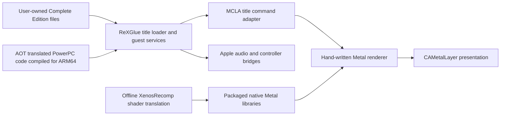

# Technical notes — 0.1.0

[Back to the README](../README.md) · [Developer guide](DEVELOPMENT.md)

## Graphics settings and defaults

| Setting | Behavior |
|---|---|
| Scene resolution | 720p, 900p or 1080p height; device aspect is handled separately. Higher settings increase scene-pixel cost. |
| FSR upscaling | Optional AMD **FSR 1** spatial EASU/RCAS path for presenting the rendered scene at output size. It is not temporal reconstruction or frame generation. |
| Texture filtering | Original/bilinear/anisotropic choices, with 4× filtering as the fresh baseline. |
| Glow & bloom | Balanced/original/reduced glow choices. Changes are applied on the next launch. |
| Disable Motion Blur | Turns off the audited guest motion-blur paths; it does not guarantee every blur-looking effect is motion blur. |
| Disable Depth of Field | Controls the guest circle-of-confusion/composite inputs. **Depth of field is enabled by default.** |
| Retail Mode | Gates ordinary diagnostic logging, captures and profiling. Enable it for a normal play session. |
| FPS & Frame-Time Graph | Available with diagnostics enabled. Double-tapping the graph starts a bounded timing capture. |
| Experimental → Native 60 FPS | The **only experimental menu option**. Standard mode remains 30 FPS. |

Fresh defaults are 720p on iPhone and 1080p on iPad, FSR off, 4× filtering, balanced bloom, motion blur on, depth of field on, and 60 FPS off. Fresh Retail Mode defaults differ by device: on for iPhone, off for iPad during this beta's diagnostic development. Set Retail Mode on explicitly if you want logging/profiling off on either device.

Existing saved preferences are retained. The Defaults action restores the saved graphics baseline and turns experimental 60 FPS off; it does not reset your control layout. Most scene/timing choices are locked during a running game and require closing/relaunching. FSR has an independent live presentation switch.

The old Packed Color Correction, Full-Screen Fades and Stable Road Detail switches have been removed. Their renderer behavior runs automatically. Making these automatic is a UI decision, **not a claim that the remaining blue-glow or road-flicker reports are resolved**.

## The experimental native 60 FPS patch

The 60 FPS option builds on **BadassBaboon's high-frame-rate research and LARecomp's engine hooks**. It is not a one-byte speed hack and is not MetalFX frame generation. The implementation renders real frames with an updated timing path.

The retail title contains **two paths that can replace a measured delta with the fixed console timestep**. Correctly adapting only one leaves the other able to publish the old fixed interval. This port enables both corrections together:

- `MCLAUseRealDelta` bypasses fixed-delta substitution after the relevant timer accumulators are updated.
- `MCLAFixedStepPath` reads the timer's already measured, unscaled delta at `timer + 0x58`, before the game's original timescale multiplication and stores.
- The guest swap-interval request changes from interval two to interval one. Both native host pacers also change to a 60 Hz period from the same launch preference.
- The timer's existing guards/clamps, timescale and **physics substep count** are retained. No late rewrite of the substep count is used.
- The existing 125 ms hitch guard remains active, bounding a long load/resume stall rather than allowing a multi-second simulation step.

The chase camera and chassis ground-depth filter also need frame-rate-independent behavior. For a console-reference smoothing coefficient `k30`, the replacement is:

```text
k(dt) = 1 − (1 − k30)^(30 × dt)
chassis depth alpha(dt) = 1 − 0.90^(30 × dt)
```

The camera hook accounts for the engine already halving its raw coefficient when its rounded FPS is below 60. Halving it again creates a discontinuity as performance crosses that boundary. Position and look-at corrections use the same reference curve and finite-input guards.

Tests compare one-second camera/chassis decay at 30, 45, 59, 60, 61 and 120 FPS, including the rounding boundary, and exercise presentation phase, rate changes and late-frame rebasing. These tests validate the math and pacer behavior. They **do not prove every car, collision, race script, traffic behavior or cinematic is correct at 60 FPS**. On-device regression testing is still required, particularly after the device warms up.

A 60 FPS frame has **16.67 ms** available. The earlier optimization target of 20 ms is useful headroom for 30 FPS, but is insufficient for a locked native 60 FPS rate. Start with 30 FPS on demanding devices and test 60 FPS before relying on it for a long session.

## Technical architecture



### Static recompilation and the Apple host

PowerPC instructions are translated to C++ ahead of time, then compiled into native ARM64 machine code. The compatibility runtime still has substantial work to do: guest memory, byte order, kernel exports, threading, filesystem semantics, title startup and audio/input contracts. "AOT" does not mean the game became an original-source engine port or that Xbox services disappeared.

The UIKit shell owns lifecycle, the visible CAMetalLayer, launch/settings UI, saves and the user's files. A versioned C bridge separates host ownership from the runtime. Backgrounding gates guest work with a condition variable without blocking UIKit's main thread. A custom vblank worker handles backward clock movement and bounds catch-up work, avoiding an unbounded unsigned-underflow catch-up loop.

### Why a direct Metal renderer

Early bring-up used shared Xenos/Vulkan machinery as a reference. The production path now intercepts the audited title command/state contract and executes native Metal work directly. It does not instantiate a generic Xbox GPU command processor, and build verification checks that Vulkan/MoltenVK/generic-processor symbols are absent from the released executable.

This is a title-specific implementation, not a general solution for every Xbox 360 game. It owns render-pipeline creation, vertex declarations and endian conversion, source-texture decode/untile, depth/color attachments, resolves, viewport/scissor mapping, sampling, resource lifetime and presentation. Three completion-owned upload slots prevent CPU reuse while the GPU still owns in-flight memory.

### Offline shader translation and coverage

The beta packages **603 native Metal title libraries**. XenosRecomp lineage provides the translation machinery; this port supplies capture/container reconstruction, audited shader ABI mapping, offline compilation and title-specific validation. A library count is a coverage inventory, not a proof that every possible race/weather/menu combination has been captured.

The ALU-order correction preserves instruction-local source values when vector and scalar units read a shared destination register before either result is written. Emitting sequential host writes can otherwise make scalar arithmetic read the just-written vector result. Snapshot scopes remain inside instruction predication. Shader constants, semantics, masks and register indices must retain their original contract.

Most normal play performs no runtime shader source translation. New missing shader pairs can be captured only with diagnostics enabled, under a fixed budget, for a later offline build. **Two newly observed programs are still absent in 0.1.0**; see Known Bugs.

### Texture, color and presentation correctness

Packed vertex colors are interpreted using the shader's destination swizzle rather than adding an unconditional second red/blue swap. A host Metal test covers red, yellow, green and blue through normalized and integer fetches. Source format `1_5_5_5` is explicitly expanded to RGBA8 after guest endian conversion; produced host resolve textures follow a separate path to avoid applying guest storage swizzles twice.

Device-aspect gameplay rendering and authored 16:9 HUD placement are handled separately. The full-screen overlay classifier recognizes full clip-space rectangles, including three-corner rectangle-list geometry, while keeping ordinary HUD elements in their authored frame. This is deliberately narrower than stretching every UI draw. The reported look-behind/title fades still require regression testing on actual gameplay paths.

Source material textures retain the original guest LOD bias rather than the earlier hidden −1.25 sharpening correction. That reduces one source of over-sharp mip selection, but does not prove intermittent road flicker is entirely mip-related; geometry/depth behavior remains a possible contributor.

### CPU and GPU work removed or reused

- **Compact draw state:** the native adapter's canonical draw representation was reduced from approximately **14,208 bytes to 1,360 bytes**, avoiding copying unused state through every draw.
- **Exact state reuse:** shader-definition snapshots, prepared pipelines, vertex/index interpretations and binding groups are reused only while their relevant inputs remain equal. Unfamiliar wrappers prove payload equality; writable/inline data cannot be treated as permanently immutable.
- **Constant-bank reuse:** used constant banks and shared push data are compared/reused rather than uploading the same data for every draw. Exact snapshots prevent a hash shortcut from silently accepting changed values.
- **Encoder-state suppression:** unchanged viewport, cull, winding, depth bias, textures, samplers and other encoder state avoid repeated Metal API calls.
- **Geometry preparation:** reusable endian/fixup plans and scratch storage reduce allocation churn; dynamic geometry uses completion-owned shared upload rings.
- **Resource invalidation:** buffer unlock/release and texture refresh participate in cache invalidation. Source and produced textures keep distinct identity/ownership rules.
- **Presentation:** steady-clock deadline accumulation handles host pacing, while a fixed-phase Metal timestamp planner provides predictable compositor lead and rebases when late. Desktop frame limiting is not added on top.
- **Diagnostics gating:** Retail Mode bypasses ordinary logging, captures, per-draw profiling and the frame graph rather than merely hiding an overlay.

These are implemented mechanisms, not independently measured percentage wins. CPU preparation, GPU execution, queue delay and presentation interval are different quantities; adding overlapping measurements produces misleading totals.

### Audio, diagnostics and evidence

Audio uses the runtime's guest XMA contract and an Apple output bridge. The title can wait on real decoder progress; a silent fake mixer is not a correct substitute. Input uses GameController, touch and CoreMotion paths at the host boundary.

Diagnostic captures include frame interval, GPU time, draw preparation, waits, cache activity and OS thermal pressure. Some displayed values are the latest completed sample rather than an exact match for the current row. Thermal state is an OS pressure category, not a temperature sensor. Sparse pass timings can overlap; do not sum them as if they were serial frame time.

Release validation covers the signed device build, packaged library inventory, absence of the legacy runtime graphics backend, existing timing/color/overlay tests and menu inspection. Public diagnostic documents are curated summaries; private device logs and identifiers are excluded.

## Known bugs and limitations

The full maintained list is [docs/KNOWN_BUGS.md](../docs/KNOWN_BUGS.md). The most important initial-beta issues are:

- **Blue distant traffic/light glows:** nearby red taillights can coexist with blue distant glows. Root cause is unresolved. A bounded color-source trace is included for a diagnostic play session; there is no claim of a completed lighting fix.
- **Two missing shaders:** VS `D866F0D1394908B8` and PS `F1DAD9A46DA1A834` were observed in the latest 60 FPS M5 run. Four adapter rejected draws were recorded in that session. These programs are not included in the 603-library package.
- **Road texture flicker/shimmer:** automatic LOD behavior addresses one candidate cause; a complete regression pass is outstanding.
- **Checkpoint smoke/colors:** shader coverage and packed-color changes were added after reports of missing smoke and wrong red/yellow colors. Correct appearance across all checkpoints is not yet confirmed.
- **Full-screen fades:** fixes are automatic, but look-behind and title-screen transitions still need coverage confirmation on both device aspects.
- **New-game rear wheel/ride-height issue:** a physically lowered car with a rear tire in the ground was reported on Air. The hitch guard is preventative; it is not a verified root-cause fix for this issue.
- **60 FPS, video timing and thermal stability:** experimental timing corrections need longer driving, race, intro, pause/resume and warm-device tests. Broader device compatibility is unverified.

## Remaining optimization and engineering work

Correctness comes first: collect the actual color inputs for the blue-glow draw, recover the two missing programs, and reproduce the new-game suspension issue. More performance work should then be based on paired measurements rather than lowering unrelated quality settings blindly.

Priorities include long-session warm-device pacing, separating useful CPU execution from wall-clock waits, measuring render-pass bandwidth/resolve cost, bounding resource-cache maintenance, checking upload-ring pressure, and expanding deterministic regression scenes for particles, alpha, shadows, fades and streaming transitions. Native 60 FPS needs both CPU and GPU to fit the display budget.

**MetalFX frame interpolation is not implemented.** It remains a future investigation involving reliable depth/motion inputs, HUD composition, history reset and presentation scheduling. **SMAA and single-tile experiments are separate developer lab paths**, not active release settings. Their presence in source is not a promise that these features ship in the beta.

## Source and developer workflow

The repository publishes the Apple host, title adapter, direct renderer, diagnostic/test utilities, local compiler modifications, pinned upstream references and dependency patches. Original game code inputs, generated title AOT output, raw shader captures, game-derived build caches, signing identities and private logs stay local.

```sh
git clone --recurse-submodules https://github.com/KoreanSeats1/MCLA-4iOS.git
cd MCLA-4iOS
sh tools/apply_dependency_patches.sh
```

The dependency lock records exact LARecomp, Theft4-foundation and XeniOS-reference revisions. LARecomp and foundation changes are published as patches rather than silently changing someone else's upstream checkout. XeniOS is a reference for audited GPU semantics; it is not the runtime backend in this release.

For a **device build**, prepare title AOT output from your own executable using the pinned ReXGlue host tools and LARecomp manifest/hooks; recreate the offline title shader corpus/metadata from your own game/captures; build the FSR library; then configure:

```sh
MCLA_CMAKE="$(command -v cmake)" sh tools/generate_xcode.sh device YOUR_APPLE_TEAM_ID
cmake --build out/build/ios-device-release --config Release --target MCLAApp
sh tools/verify_mcla_metal_build.sh
```

**Important build limitation:** the initial source release is an engineering snapshot, not a one-command clean-room build from a disc. The current shader rebuild tools expect locally prepared capture/container/HLSL directories, and historical fallback paths may require configuration. Those inputs are deliberately excluded. See [Developer Guide](../docs/DEVELOPMENT.md) for the required stages and honest gaps. Downloading the public source ZIP alone will not produce a playable app.

Run portable regression checks with `sh tools/run_portable_tests.sh`. Metal GPU tests require a Mac with usable Metal access; simulator-menu compilation does not validate physical gameplay. The release packaging tool refuses original game files and strips personal provisioning/signing material from the re-signable IPA copy. It does not modify your installed app or private signing identity.

